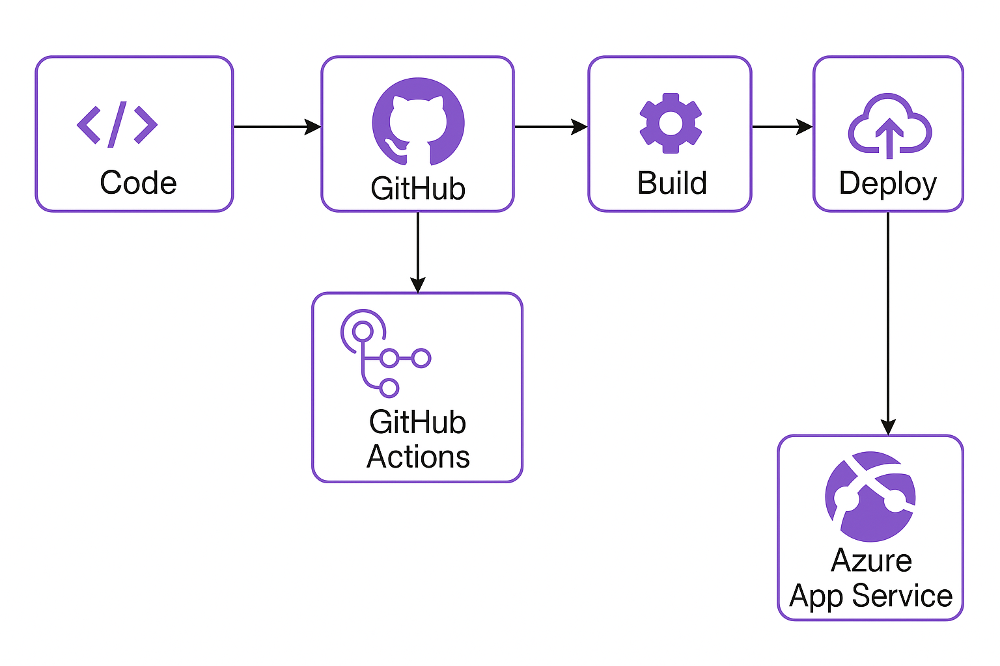
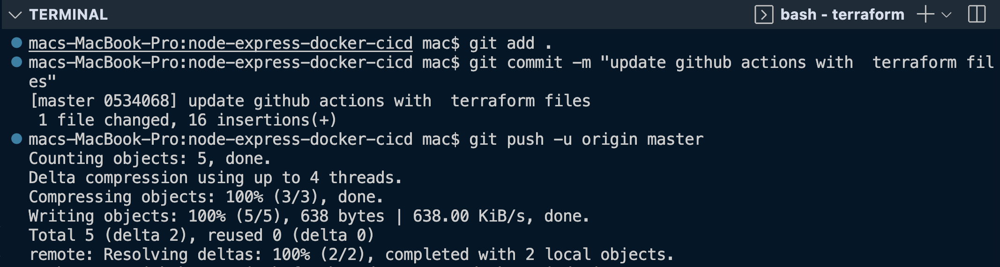
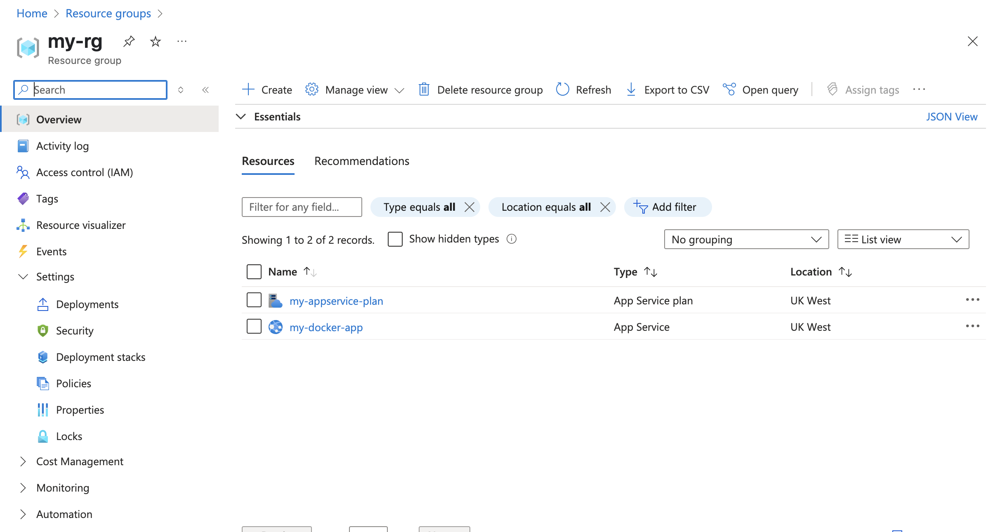
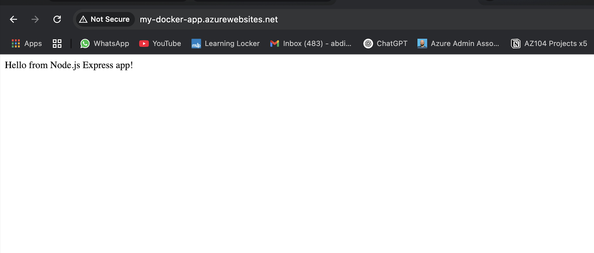

# Node.js + Express App with CI/CD to Azure using Docker, Github, Github actions and Terraform.

This project is a complete a simple cicd pipeline for deploying a Node.js web app using containerized infrastructure and fully automated GitHub Actions workflows. It supports automatic build, push, and deployment on every push to the `master` branch.
---

---

## What This Project Does

- Builds a simple Node.js + Express app

- Containerizes the app using Docker

- Automates Docker image build and push to Docker Hub using GitHub Actions

- Deploys infrastructure to Azure App Service using Terraform

- Automatically deploys the pushed Docker image to the Azure App Service

- Uses GitHub Secrets to securely manage credentials

---

## CI/CD Workflow Overview

1. You push code to the `master` branch
2. GitHub Actions triggers the pipeline:
   - Checks out code

   - Builds a Docker image

   - Pushes the image to Docker Hub

   - Provisions Azure infrastructure using Terraform (from the `terraform/` folder)
   
   - Deploys the new Docker image to Azure App Service

This means everything — from infrastructure provisioning to app deployment — is automated with a single `git push`.

--

---

---

---
## GitHub Secrets Required

To enable secure access in your GitHub workflows, define the following secrets in your repository settings:

- DOCKER_USERNAME  
- DOCKER_PASSWORD  
- AZURE_WEBAPP_PUBLISH_PROFILE  
- ARM_CLIENT_ID  
- ARM_CLIENT_SECRET  
- ARM_SUBSCRIPTION_ID  
- ARM_TENANT_ID

## Infrastructure as Code (Terraform)
The terraform/ directory contains the configuration to deploy:

 - Azure Resource Group

 - App Service Plan

 - App Service (Docker container enabled)

The Terraform steps are also run automatically from GitHub Actions, but if you want to run them manually:

 - cd terraform
 - terraform init
 - terraform apply

### Destroying Resources
To delete all deployed Azure resources:

Run terraform destroy from the terraform/ directory

Or manually delete the resource group from the Azure Portal

## Running Locally

To test the app locally:
 - cd src
 - npm install
 - node index.js

To build and run with Docker locally:
 - docker build -f docker/Dockerfile -t your-username/node-express-azure:latest .
 - docker run -p 3000:3000 your-username/node-express-azure
    
    
    
## Summary
This project demonstrates a simple, production-style deployment pipeline with:
 - Containerized app deployment

 - GitHub Actions automation

 - Infrastructure provisioning via Terraform

 - Secure, repeatable cloud deployment to Azure

## License

This project is licensed under the MIT License. You are free to use, modify, and distribute it with proper attribution.

See the [LICENSE](./LICENSE) file for full details.
